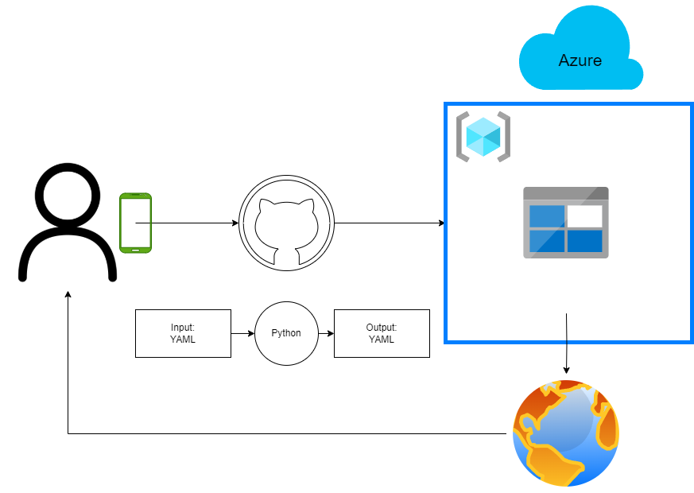

# NomStats
First things first, congratulations for actually reading a README!

Secondly, NomStats is a tool for generating and hosting recipe websites with nutritional information. It calculates nutritional values based on provided ingredients and recipes, generates HTML pages, and deploys them to Azure Blob Storage.

## Schematic overview

## How it works
1. **Recipe & Ingredient Configuration**:
   - Define ingredients with nutritional data in `ingredients.yaml`.
   - Create recipe files (e.g., `individual_recipe.yaml`) with ingredients, steps, and ratings according to the existing examples.

2. **Deployment**:
   - Store credentials of an Azure Service principal with enough rights on your Azure environment in GitHub.
   - Use GitHub Actions to:
        - Run the `generate_static_website.py` script to generate HTML pages for all recipes.
        - Deploy the html pages to Azure Blob Storage (`Create NomStats`) and or clean up resources (`Delete NomStats`).
        - Use Azure CLI to turn on static website capability.

This of course does not explain the complete functionality of this project. Want to know more? Don't be shy, ask the creator of this repo!

## To Do
- possibility to put folders in folders and have them represented that way in the index.html dynamically
- make the base ingredients of all recipes enough for one portion, then make a counter which you can increase on the recipe page to up the portions
- ingredients.yaml file as csv file?